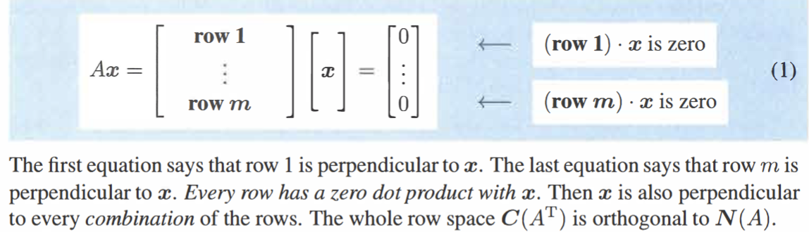
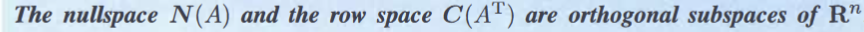
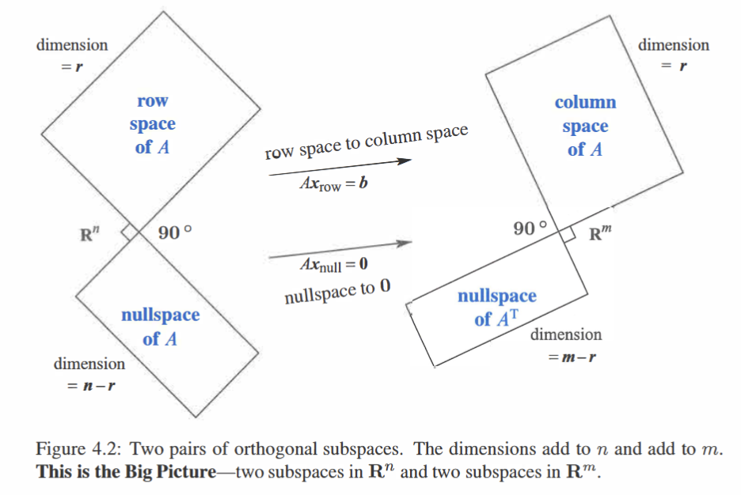
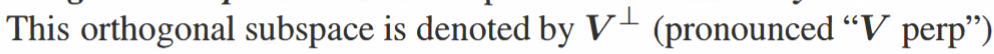
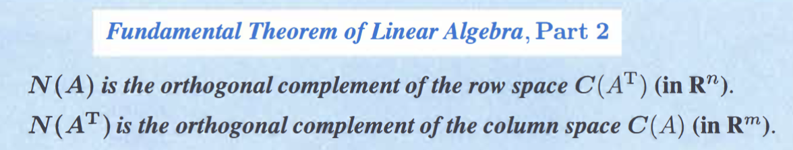
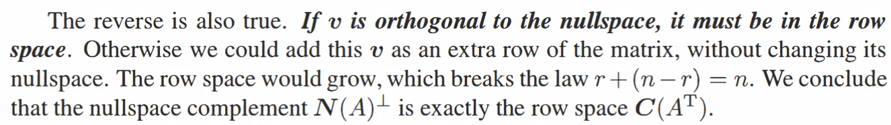
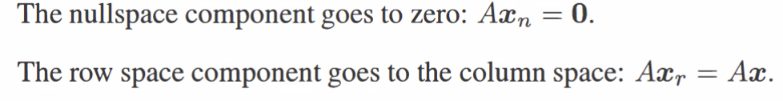
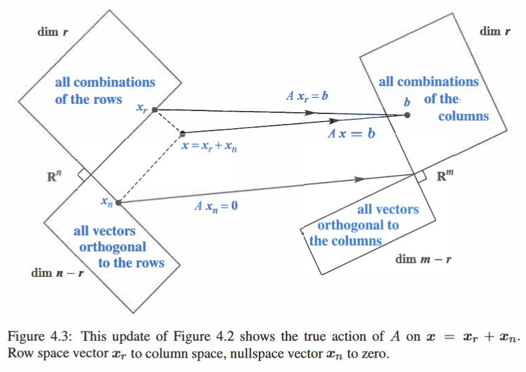

---
tags:
  - "#数学/线性代数"
---

# 4.1 Orthogonality of the Four Subspaces

> **Core idea:** The four fundamental subspaces come in two orthogonal pairs. They are not just orthogonal — they are orthogonal *complements*, meaning each contains *every* vector orthogonal to the other.

---

## 1. Orthogonal Vectors & Orthogonal Subspaces

### Definitions

$v$ and $w$ are orthogonal iff $v^{T}w = 0$.

Two subspaces $V$ and $W$ are orthogonal iff $v^{T}w = 0$ for **every** $v \in V$ and **every** $w \in W$.

Key word: *every*. Not "there exists some."

### The Two Orthogonal Pairs

| Pair | Live in |
|------|---------|
| Row space $\perp$ Nullspace | $\mathbb{R}^{n}$ |
| Column space $\perp$ $N(A^{T})$ | $\mathbb{R}^{m}$ |

### Proof: Row Space ⟂ Nullspace

View $Ax$ as the dot product of each row of $A$ with $x$:

- $x \in N(A) \implies Ax = 0$
- Each component of $Ax$ = a row of $A$ dotted with $x$
- So **every row** of $A$ is orthogonal to $x$
- Rows span the row space → any linear combination is also orthogonal to $x$
- Therefore: row space $\perp$ nullspace ∎

Same argument with $A^{T}$: $x^{T}(A^{T}y) = 0$, where $A^{T}y$ is a combination of rows of $A^{T}$ = columns of $A$ → column space $\perp$ left nullspace.

> **My words:** The proof is one line of insight: $Ax = 0$ literally means "each row of A dot x equals zero." The nullspace is, by definition, the set of vectors orthogonal to every row. So of course they're orthogonal — it's almost tautological once you see it.

---

## 2. Orthogonal Complements

### Definition

Row space and nullspace are not just orthogonal subspaces — they are **orthogonal complements**.

The orthogonal complement of $V$, denoted $V^{\perp}$, contains **every** vector orthogonal to $V$.

- Nullspace = (Row space)$^{\perp}$
- Left nullspace = (Column space)$^{\perp}$

### Dimension Formula

$$
\dim(\text{Row space}) + \dim(\text{Nullspace}) = r + (n-r) = n
$$
$$
\dim(\text{Column space}) + \dim(\text{Left nullspace}) = r + (m-r) = m
$$

The dimensions fill the whole space — there's no room for more.

### Proof of "Every Vector"

**Algebraic:** The two subspaces are orthogonal and their dimensions sum to $n$. If the nullspace were missing some vector orthogonal to the row space, that vector would have nowhere to go — but dimensions already add up to $n$, so no vector is missing.

**Geometric:** Both subspaces go through the origin. Once the row space is fixed, the nullspace is determined — it's exactly the set of all directions perpendicular to every row-space direction. Their intersection is only the zero vector.

A line through the origin: every vector parallel to it is in the line itself.

> **My words:** "Orthogonal complement" is stronger than "orthogonal." Two lines in R^3 through the origin can be orthogonal — but they're not complements (they leave a whole plane unaccounted for). Complements mean "together we span everything."

---

## 3. Fundamental Decomposition: $x = x_r + x_n$

Every vector $x \in \mathbb{R}^{n}$ splits uniquely into:

$$x = x_r + x_n$$

- $x_r \in$ Row space — the **effective** part
- $x_n \in$ Nullspace — the **ineffective** part (killed by $A$)

Apply $A$: $Ax = A(x_r + x_n) = Ax_r + 0 = Ax_r$

**Every $b$ in the column space comes from exactly one $x_r$ in the row space.** This is a bijection (双射).

### The Hidden Invertible $r \times r$ Matrix

Inside $A$ there is an $r \times r$ invertible matrix — the restriction of $A$ to the row space.

The mapping $x_r \mapsto Ax_r$ is a bijection → invertible. Adding the nullspace directions ($Ax_n = 0$) is what makes the full $A$ non-invertible.

The decomposition works symmetrically in $\mathbb{R}^{m}$ for column space + left nullspace.

> **My words:** Think of projecting a force vector onto a direction of motion. The perpendicular component does zero work — it's $x_n$. The parallel component does all the work — it's $x_r$. $A$ only "sees" $x_r$.

---

## 4. Combining Bases from Subspaces

Every $x = x_r + x_n$.

- $Ax_r$: the effective part — produces output
- $Ax_n = 0$: the ineffective part — contributes nothing

Like decomposing a force in physics: only the component along the direction of action matters.

---

## Connections

- [[4.2 Projections]] — 4.1 says subspaces are orthogonal; 4.2 says "given a vector, find its component in a subspace" — that's projection, and it needs orthogonality
- [[3.1 Spaces of vectors]] — 3.1 defines the four subspaces; 4.1 establishes their geometric relationship
- [[3.4 Independence Basis and Dimention]] — the dimension formulas in 4.1 ($r + (n-r) = n$) rely on 3.4's rank-nullity foundation
- [[2.2 Elimation matricies and inverse matrices]] — the $r \times r$ invertible matrix hidden inside $A$ connects back to elimination and pivots
- [[Inverse&independent&rank&determinant&pibots]] — the bijection between row space and column space is why rank counts both

← [[MIT LA.MOC|MIT 18.06 MOC]]
