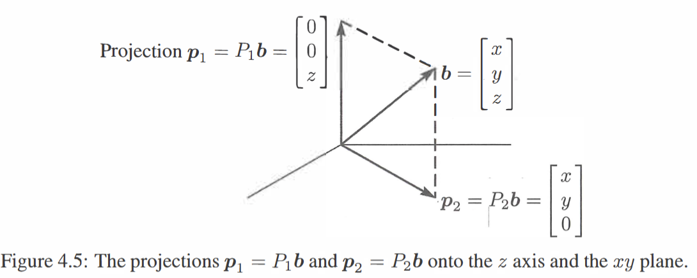
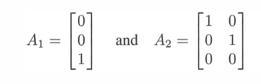
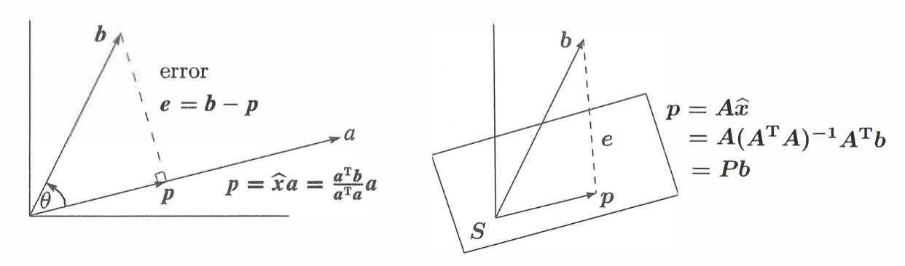
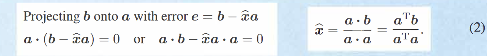
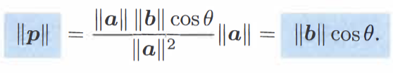
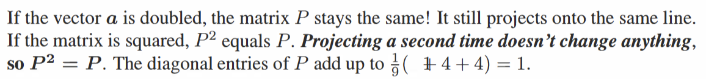
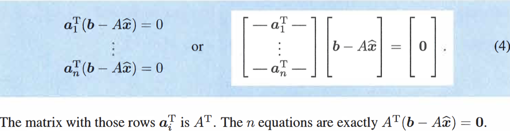
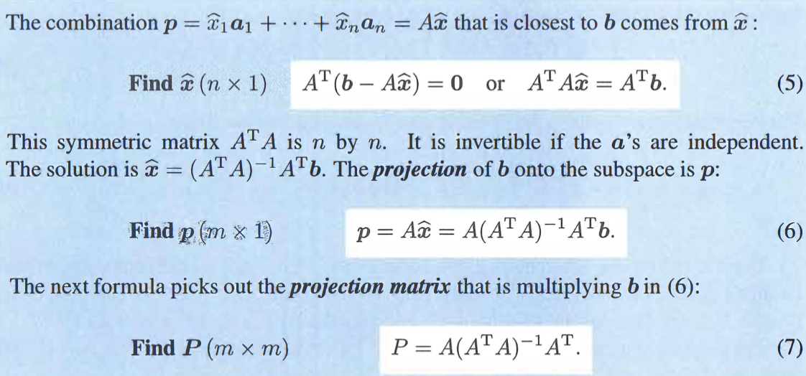
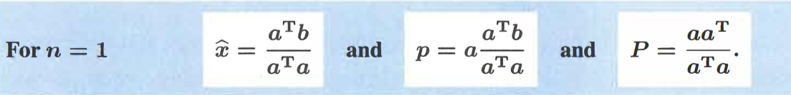

start with an example:
The projection of $b$ on $z$ axis; and $x-y$ plane

the $z$ axis; and $x-y$ plane are orthogonal complements$\implies$ 
$b=p_{1}+p_{2}$ ; $P_{1}+P_{2}=I$

or: projecting onto the column spaces of $A_{1}$ $A_{2}$

---
goal for projections: find the part $p$ in each subspace;  the projection matrix $P$ that peodues that part $p=Pb$

### Projection Onto a Line
The projection of $b$  on $a$  call it $p=\hat{x}a$
$e=b-p$

$p=\frac{a^{T}b}{a^{T}a}a$
see this from a different perspective:
$p=a\hat{x}=a\frac{a^{T}b}{a^{T}a}=\frac{aa^{T}}{a^{T}a} b=Pb$
project matrix: $P=\frac{aa^{T}}{a^{T}a}$

 - the comprehension of dot products

- two special cases: $b=a$  & $b$ is perpendicular to $a$

- the special attributes of $P$

& $I-P$ projects onto the perpendicular subspace of the line! $e=(I-p)b$

### Projection Onto a Subspace
for $n$ vectors $a_{1}\dots a_{n}$ in $R^{m}$  $n$ are linearly independent
the subsapce can be discribed as $C(A)$ whose columns are the $n$ vectors
$\hat{x}$: another vector! $A\hat{x}$: a particular column space of $A$
$b$: a vector/ a line
==aim==: ***Find the combination $p=\hat{x_{1}}a_{1}+\dots+\hat{x_{n}}a_{n}$***  closest to a given vector $b$***
$n$=1: previous situation

$\implies$*Find the vector* $\hat{x}$  ,find the projection $p=A\hat{x}$; find the projection matrix $P$
the closest situation: the error vector is perpendicular to the subspace!

$\implies$ $A^{T}A\hat{x}=A^{T}b$
or: another proof: the subspace is the column space of $A$  ; The error vector is perpendicular to that column space $\implies$ $b-A\hat{x}$ is the nullspace of $A^{T}$  $\implies$ the result!

$p,P$ are formed by this equation!

$A^{T}$ dot product $(\dots)$ : find the thing perpandicular to $C(A)$; $A\hat{x}$ :find a linear combination of the columns of A / find a place on the column space of $A$; $b-\hat{x}$A: the error vector
 $n=1$ corresponds to this!

>[!notice]-
>$A$ and $A^{T}$ are rectangular matricies, they do not iave inverse matricies; but $(AA^{T})$ has one

**$A^{T}A$ is only invertible if and only if $A$ has linearly independent columns, during which $A^{T}A$ is square/symmetric/invertible**

