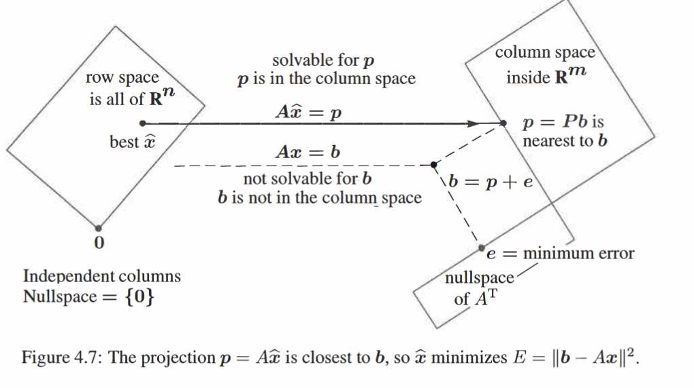

for $Ax=b$  often no solutions! e.g when $m>n$ $\iff$ The $n$ columns only span a small part of the $m$-dimentional space;
(the columns of A are indep-endent)
but we can still find a closest solution!
### Minimizing the Error: Least squares
[[Error Minization_three perspective]]

### The Big Picture

### [[Common formula for a line]]

Why do we use least squares: because the deteritive of a square is linear, so we can use linear algrbra to solve the minumun situation

### [[When A has dependent columns]]

### [[Fitting by a Parabola]]
