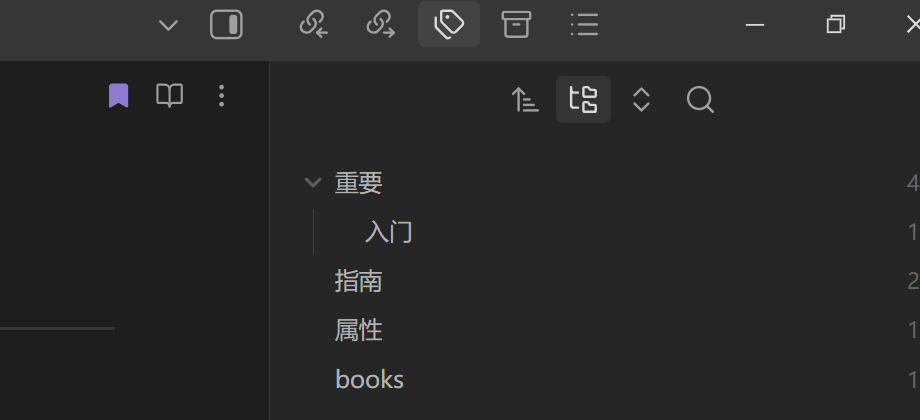
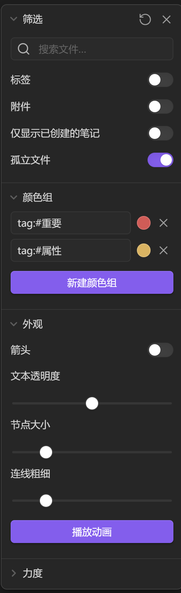
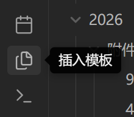

---
tags:
  - 重要
  - "#重要/入门"
  - "#属性"
  - "#指南/markdown"
aliases:
  - In case you forget basic Grammar!
cssclasses:
---
---：在文件开头创建笔记属性栏


#指南
#重要   （一个文件可能有复合属性，但只能存到一个folder里 所以用tag来描述文档的复合属性）
(aliases:别名) 上面的是笔记属性（properties） 在文档中创建必须在最左侧按“#”
属性中添加子属性：# 属性/子属性

---
建立书签：   选中文档后点  此 加入书签：一个文档有多个书签
书签vs标签
一个文档---->多个书签；    一个标签---->多个文档；但文档中也可以有多个标签
___


在笔记头部添加属性的方法：Ctrl+;
# Heading1
## Heading2
### Heading3
### Heading4
##### Heading5#####
###### Heading6######

**bold**
*Italic*
- Bullet Item1
- Bullet Item 2
	- press tab for a Nested Item
- press "enter " twice to return to Item 3
1. Number 1 (写1. 再加一个空格变成符号形式)
2. Number 2
---

[[2026/未命名]]([[]] 来创建)
[[2026/nihao1]](提前创建一个不存在的file)
[google](http://www.google.com)(创建网页链接 []名字+（）链接)
[CS self-learning guide](https:csdiy.wiki)
开链接保留原文件：ctrl+左键点击链接
开链接 保留原文件+在右侧分屏查看：ctrl+alt+左键点击链接

---

==Highlight Text==
~~Strikethrough~~
- [ ] Checkbox 1 (方法：- 【 】 )
- [ ] Checkbox 2
- [x] Checkbox 3
---


右侧：多种索引方式：来链接 去链接 标签；书签
文件夹：严格的格式与结构    标签：分类  链接：看关系   书签：像目录一样
上侧有多种检索方式  来连接 去链接 标签 以及属性栏搜索

---


对于思维导图：可以在设置中对大的思维导图展开调整；呈现标签/不呈现标签

---
templates:
已创建_templates模板库 对于重复内容 直接点这个插入即可

---
代码块： 不换行：`.txt` `.doc`
换行：
```(name of language)
6666
```


---
插件
1、dataview  与canvas结合

写点笔记，[[创建链接]]，或者试一试[导入器](https://help.obsidian.md/Plugins/Importer)插件!

当你准备好了，就将该笔记文件删除，使这个仓库为你所用。

---
[Markdown Cheat Sheet | Markdown Guide](https://www.markdownguide.org/cheat-sheet/)


---
### 1. 跳转到特定“标题 / 子标题” (使用 `#`)

如果你想链接到某个具体的标题结构（如 `## 二级标题`），你需要使用 **井号 `#`**。

- **跳到另一篇文档的标题：** 输入 `[[` 选择目标文档后，紧接着输入 `#`，Obsidian 会自动弹出一个下拉菜单，列出该文档里的所有标题。
    
    - **语法：** `[[文档名称#标题名称]]`
        
    - **示例：** `[[我的日记#2026年目标]]`
        
- **跳到当前文档的标题：** 不需要输入文档名，直接输入 `[[#`，就会弹出当前文档的标题列表。
    
    - **语法：** `[[#当前文档的某个标题]]`
        

### 2. 跳转到具体的“内容块 / 段落” (使用 `^`)

如果你想跳转的地方没有小标题，只是一个普通的段落、一句名言或者一个列表项，你可以使用“块链接”，这需要用到 **脱字符 `^`**。

- **跳到另一篇文档的特定段落：** 输入 `[[` 选择文档后，紧接着输入 `^`，Obsidian 会按顺序列出该文档里的所有文本块。你也可以继续打字来搜索特定内容。选择后，Obsidian 会自动在那个段落末尾生成一串隐藏的字母数字组合（如 `^a1b2c`）作为锚点。
    
    - **语法：** `[[文档名称^段落专属ID]]`
        
- **跳到当前文档的特定段落：** 直接输入 `[[^` 即可搜索并链接当前文档内的段落。
    
    - **语法：** `[[^段落专属ID]]`
        

---

### 💡 进阶小贴士：美化链接显示文本

带着 `#` 和 `^` 的链接在阅读时可能看起来有些杂乱。你可以使用 **竖线 `|`**（在回车键上方）来重命名这个链接的显示文本。

- **语法：** `[[文档名#标题名|你想显示的文字]]`
    
- **示例：** `[[会议记录#行动清单|点击查看下一步要做什么]]`
    
- **效果：** 你的笔记中只会显示整洁的“点击查看下一步要做什么”，但点击它依然会精准跳转到《会议记录》这篇文档的“行动清单”标题下。


# 原子笔记原则：
### 筛子 1：跨领域的“底层基石” (The Building Blocks)

如果一个概念不仅仅存在于当前这门课、这篇文章里，而是支撑你未来解决其他高阶问题的基础设施，那它必须被抽离出来。

- **❌ 不该做原子笔记的：** 比如你在 Lec 01 截图里记录的“如何求解 1.4.5 里的分数 $x, y$”。这只是这道题的计算步骤，离开这道题它毫无意义，把它折叠在当天的课堂笔记里即可。
    
- **✅ 应该做原子笔记的：** 比如 `[[矩阵的秩 (Rank)]]` 或 `[[列空间 (Column Space)]]`。因为未来当你在研究算法博弈论、设计复杂的机制与收益矩阵时，或者在处理主从机械臂运动学中庞大的状态空间时，你依然需要调用“秩”和“空间”的概念来降维。这种基石，必须独立成卡。
    

### 筛子 2：解决特定痛点的“核心机制” (The Mechanisms)

当你遇到一个精妙的算法思想、或者一种特定的工程解决思路时，把它提炼出来。

- **❌ 不该做原子笔记的：** 某一次实验的详细报错日志，或者某一周的项目汇报流水。
    
- **✅ 应该做原子笔记的：** 比如在推进 ClawGuard 项目时，关于 `[[电磁侧信道检测 (EM Side-Channel)]]` 的核心技术原理。不要把它淹没在“4月项目进度”这样的时间流笔记里。把它单独抽出来，写清楚它是如何利用硬件物理信号来识别 AI 智能体安全漏洞的。以后遇到类似的安全研究，直接链接这个概念。
    

### 筛子 3：被反复调用的“高频刺客” (The Rule of Two)

这是最简单粗暴的一个筛子。

如果你第一次看到一个概念，拿不准它要不要做原子笔记，**那就先不要做**，让它留在原处。

但是，如果你在用 C++ 和 Linux 工具搭建研究环境时，或者在看另一篇新论文时，**第二次**甚至**第三次**遇到了同一个名词（比如某个特定的图论算法、或者某种矩阵分解法）——不要犹豫，它在向你证明它的价值，立刻为它新建一个 `[[ ]]` 原子卡片。

---

**总结一下：**

原子笔记的本质，是你大脑里的“通用函数库”。

- **记原子笔记：** 记原理、记机制、记通用模型、记你自己顿悟的那句大白话。
    
- **不记原子笔记：** 不记具体算例、不记特定题目的解法、不记一次性的操作流水。


---


# 如何记原子笔记？
### 第二部分：原子笔记是上课记，还是课后记？

**直接给你一个斩钉截铁的结论：绝对不要在上课（Input）的时候去新建和编写原子笔记！** 所有的原子化重构，**必须**留在课后复盘（Refactor）时进行。

我们可以用写代码的逻辑来理解为什么要这么做：

#### 1. 上课时（Input 阶段）：只做“声明 (Declare)”，不写“实现 (Implement)”

上课或看论文时，你的大脑 CPU 全部被用来理解教授的逻辑推导和数学推演了。如果你此时突然切出去写一张完美的原子卡片：

- **打断心流：** 你会错过教授接下来的两句话，导致后面的逻辑全盘崩溃。
    
- **视野局限：** 上课时你往往不知道这个概念在整节课里的分量。有可能你刚花 5 分钟给它写了原子笔记，结果教授后面说“这个方法其实已经被淘汰了，我们看下一个”。
    

**👉 上课时你应该怎么做？** 只写“占位符”。听到感觉很厉害的词，直接在当天的流水账笔记里敲出 `[[外积]]`。**不要去点击它！** 让它在 Obsidian 里保持为一个暗色的“幽灵链接（未创建的空链接）”。然后继续听课。

#### 2. 课后复盘时（Refactor 阶段）：完成“编译与封装”

课后（最好是当天晚上，或者第二天），这才是你作为“架构师”发力的时刻。 此时你的大脑已经跳出了细节的泥潭，有了全局视角。

**👉 课后复盘时你应该怎么做？**

1. **扫描幽灵链接：** 打开你今天的 `Lec 01`，扫视里面那些暗色的 `[[ ]]`。
    
2. **执行“三筛法则”：** 冷静地评估一下，这个幽灵链接真的配做成原子卡片吗？如果冷静下来觉得它就是个一次性知识，直接把 `[[ ]]` 括号删掉，让它退化成普通文本。
    
3. **新建与封装：** 如果确定它是硬核基石，点击它！Obsidian 会自动在 `02_Concepts` 里生成卡片。你花 3 分钟，用自己的大白话、联系你正在搞的机器人或侧信道检测项目，把它的本质写下来。

---


### 1. 改变图标与颜色的 Callouts (高频必备)

你可以通过更改方括号里的**英文单词**，来召唤出不同颜色和自带图标的区块。这在视觉上能极大地帮助大脑进行信息分类。

你可以直接把下面这些代码复制到你的 Obsidian 里看看效果：

Markdown

```
> [!note] 备忘录 (默认蓝色)
> 这里可以放一些普通的补充说明，比如：Strang 教授在这里提到了高斯消元的历史。

> [!tip] 核心洞见 (绿色灯泡)
> 这是你做原子笔记最需要的类型！把你的“顿悟”写在这里。比如：外积的本质就是空间维度的膨胀。

> [!warning] 易错点/边界条件 (橙色警告)
> 当遇到特殊情况时用这个。比如：注意！只有当矩阵满秩时，这个逆矩阵才存在，写 C++ 矩阵求逆算法时务必先加一个行列式是否为 0 的 assert() 判断。

> [!bug] 报错与 Debug (红色虫子)
> 在配置 ROS2 或者写底层驱动时遇到 Segmentation Fault，把报错日志和最终的解决思路扔进这里。

> [!quote] 引用 (灰色引用符号)
> 用来摘抄原版教材或经典论文里极其优美、值得一字不落背下来的原话。
```

### 2. 控制折叠状态的终极语法 (`+` 和 `-`)

你已经知道了加 `-` 是默认折叠，其实还有一套完整的心法：

- **默认展开，不可折叠 (直接写词)：** `> [!tip]` (适合最核心的直觉，必须一眼看到)
    
- **默认折叠，点击展开 (加 `-`)：** `> [!example]-` (适合长篇大论的数学证明、几十行的报错日志、大段的补充截图。起到“眼不见心不烦”的兜底作用)
    
- **默认展开，但允许折叠 (加 `+`)：** `> [!note]+` (适合那些目前比较重要，但你希望复习完后可以手动把它收起来的内容)
    

**实操小技巧：自定义标题** 如果你不想用系统默认的标题（比如你不想它显示 "Example"），你可以直接在方括号后面加上你自己的标题：

Markdown

```
> [!example]- 极其枯燥的 $A=CR$ 完整数学归纳法证明过程
> （这里塞满具体的公式推演，把它折叠起来）
```

### 3. 原生 HTML 的折叠 (无边框的极简主义)

有时候，Callouts 带有背景色和边框，如果你在一篇笔记里用得太多，会显得花花绿绿的，视觉上很乱。

如果你只想**纯粹地隐藏一段文字或图片**，不想要任何多余的颜色和边框，你可以使用原生的 HTML 标签 `<details>`。这在整理大段代码时极其好用：

HTML

````
<details>
<summary>点击查看：用 C++ 实现外积运算的底层源码</summary>

这里可以放一大堆东西，包括截图、公式，或者是 Markdown 代码块：
```cpp
// 一段暴力求解矩阵乘法的伪代码
for(int i=0; i<m; i++){
    for(int j=0; j<p; j++){
        // ...
    }
}
````

### 4. 脚注 (Footnotes)：保持正文的绝对干净

如果你在写一段非常精炼的“API 式总结”，但又忍不住想补充一句“这个定理在《线性代数及其应用》第 43 页”，你可以用**脚注**。

它不会打断正文的阅读心流，而是把杂音统统扫到了页面最底部。

Markdown

```
矩阵的行秩必然等于列秩 [^1]。这个特性在处理多智能体博弈的巨大状态空间时，可以帮我们剔除大量的冗余维度。

[^1]: 这里用到了 $A=CR$ 分解的思想，证明过程非常巧妙，详见教材第一章。
```


[MarkDown语法 超详细教程 - 经验分享 - Obsidian 中文论坛](https://forum-zh.obsidian.md/t/topic/435)